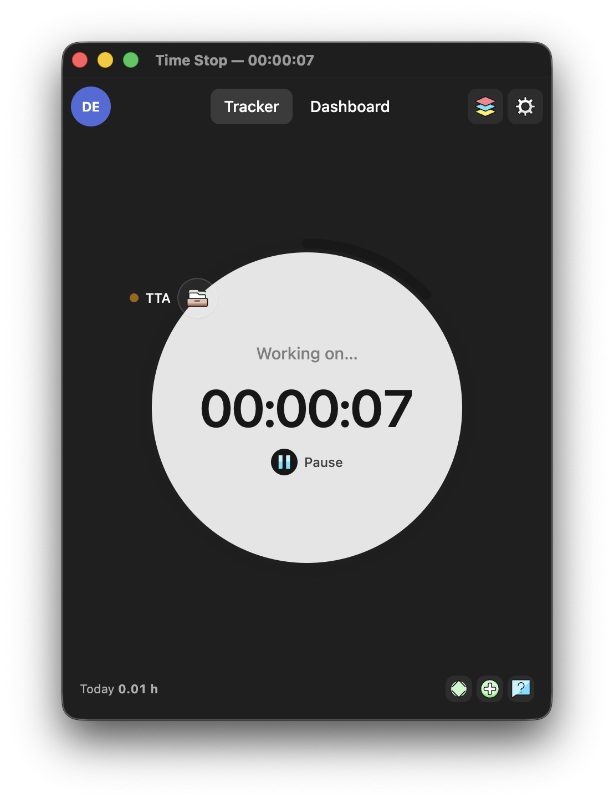
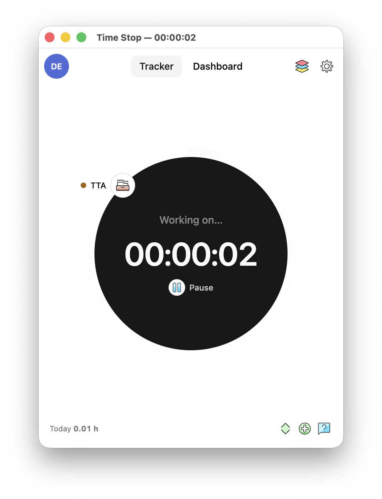
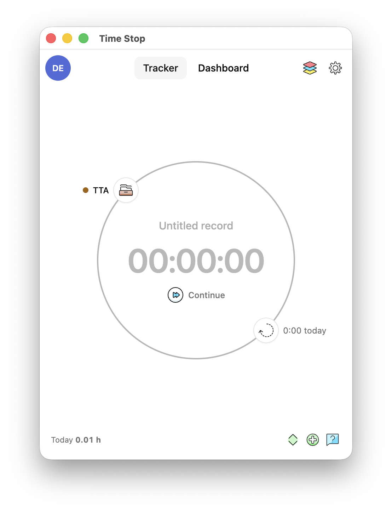
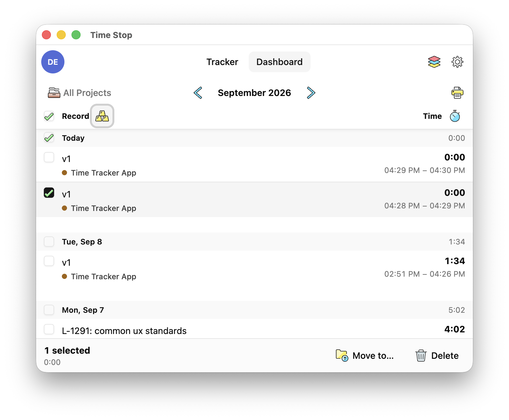
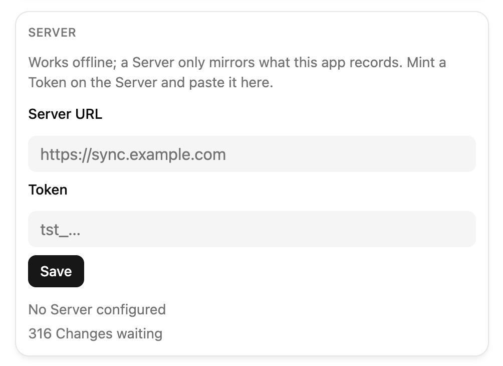

# Time Stop

[](https://github.com/konfrontend/timestop/actions/workflows/ci.yml)
[](https://github.com/konfrontend/timestop/releases/latest)

&replace=%241&label=node>)
[](LICENSE)

Time tracking that shows what things really take, for you and your agents.

Over days and weeks your records add up to an honest picture of what your work actually takes, with nothing guessed or remembered. Read it back by project, by week, or down to one task. It reports what happened and leaves the conclusions to you.

Working with agents? Let them record too. Their tokens and their time land on the same tasks as yours, so the picture stays whole. Not there yet; see the [roadmap](docs/roadmap.md).

Yours, locally, forever. Have a team, or a second machine? An optional self-hosted server keeps every copy in sync and, later, brings other people in with their own records and roles.

<p align="center">
  
  
  
</p>

<p align="center">
  
</p>

## Install the app

macOS on Apple Silicon and Windows x64. Download the installer for your platform from the latest [GitHub Release](https://github.com/konfrontend/timestop/releases/latest) and open it.

The installers are unsigned, so macOS and Windows each warn once on first launch; allow it. Every new version asks once more.

### Updates

On launch the app checks GitHub Releases. When a newer version exists, a notice under the tabs links to its download; install it the same way, replacing the app in Applications. The check stays silent when it cannot reach GitHub.

Settings shows the running version at the bottom.

### Server

Optional. The app works offline, forever; a Server keeps a mirror of what it records.

```
  Your machine                              Your Server (optional)
 ┌────────────────────────────┐            ┌────────────────────────────┐
 │  Time Stop                 │            │  the same Workspaces,      │
 │  every edit lands in the   │    Push    │  Clients, Projects and     │
 │  local database, plus one  │ ─────────▶ │  Records                   │
 │  Change in a log           │  one way,  │  + the full Change history │
 │                            │  queued    │                            │
 │  works offline, forever    │  offline   │  never sends data back     │
 └────────────────────────────┘            └────────────────────────────┘
```

Deploying one and minting a Token: [docs/self-host.md](docs/self-host.md). Paste the Token under Settings → Server.

<p align="center">
  
</p>

## Development

npm workspaces + Turborepo.

### Layout

- [`apps/desktop`](apps/desktop/README.md) — Electron app: SQLite, Tracker, Dashboard, Settings, Toggl import.
- [`apps/server`](apps/server/README.md) — Hono server: ingests Changes into Postgres, mints Tokens.
- [`packages/domain`](packages/domain) — one folder per glossary term with its schema and `Api` descriptors; the sync wire format.
- [`packages/db`](packages/db) — Drizzle schemas and migrations for SQLite (desktop) and Postgres (server); the `Api` implementation and the push loop.
- `packages/tsconfig`, `packages/eslint-config` — shared tooling configs.
- [`CONTEXT.md`](CONTEXT.md) — the vocabulary; every identifier in the code uses these words.
- [`docs`](docs) — [decisions](docs/adr), starting with [why this stack](docs/adr/0001-v1-tech-stack.md); [entity rules](docs/data-hierarchy.md); [self-hosting](docs/self-host.md); [releasing](docs/release.md).

### Dependency graph

```
                 ┌───────────────────────┐
                 │      @app/domain      │   zod, luxon
                 └───────────┬───────────┘
                             │
          ┌──────────────────┼──────────────────────┐
          ▼                  ▼                      ▼
┌──────────────────┐ ┌────────────────────┐ ┌───────────────────┐
│  @app/db         │ │ @app/desktop       │ │ @app/server       │
│ better-sqlite3,  │ │ (renderer imports  │ │ hono,             │
│ postgres, drizzle│ │  domain only; main │ │ @hono/node-server │
│                  │ │  adds luxon for    │ │                   │
│                  │ │  the Toggl import) │ │                   │
└───────┬──────────┘ └───────▲────────────┘ └───────▲───────────┘
        │                    │                      │
        └────────────────────┴──────────────────────┘  (server imports @app/db/postgres)
```
